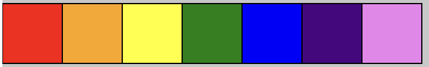

# TRAVERSALS

Each for loop has a set structure. Let's look at an example:

```javascript
for(let i = 0; i<5; i++){
  //DO SOMETHING
}
```

Here's a more precise look at exactly how these three statements are implemented. This is generally not helpful for first-time students.

- The first statement is the starting value of the loop - it's run only once, before the loop begins. The loop above begins with the number 0, but could start anywhere.
- The second statement is run before each iteration in the loop. The code block is only executed when this second statement evaluates to `True`.
- The third statement is run after each iteration in the loop. much we want to increment by every time the loops runs. In the above example, i will increase by 1 (`i++` is shorthand for `i = i + 1` or `i += 1`), but you could just as easily skip-count by 3s or any other number with something like `i = i + 3`.


We can combine this knowledge of for loops to our previous knowledge of arrays. Suppose we have the following list:
```javascript
var myArray = ["I", "like", "to", "use", "arrays"]
```
We could use a `for` loop to iterate through this array and print out each value. This is known as a **traversal**
```javascript
for(var i = 0; i < myArray.length; i++){
	// i runs from 0 up to 1 less than the length of the array
	// We then use i to access the value as it can be the index value we pass in.
	console.log(myArray[i])
}
```

## Task Today

Compelte the problems outlined below on `script.js`. 

**WARM UP**: Print out every name in the array shown on line 2 of `script.js`.

1. An array of songs has been proved. Add 5 of your favorite songs to the list. Use a for loop to print out each item by saying "I like to listen to Halo", "I like to listen to Crazy in Love", etc.

2. I have given you a large list of numbers with scores from a recent project. I have made a typo in everyone's grade and they are too large. Divide each grade my 100 to get the actual grade. Print out the correct value to the console.

3. An array of colors have been provided. Use a for loop to draw a rectangle for each color.



4. Add 3-4 more colors to your colors array. Draw circles on top of one aother going down the page. One for each color.


5.  Draw circles of variable size using the numbers  stored in the `sizes` array.


6. Use the sizes array to draw circles that get progressively larger as they iterate through the colors array. **HINT**: You should look up `sort()` method for arrays.


7. Right now the spacing doesn't make sense. Increment the spacing inceases as you draw progressively larger circles.


8. Use nested iteration to create a pattern of squares. Color each square with a colors from the colors array. You should work your way sequentially through the array.

